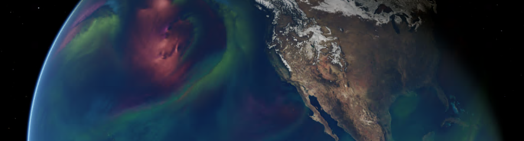
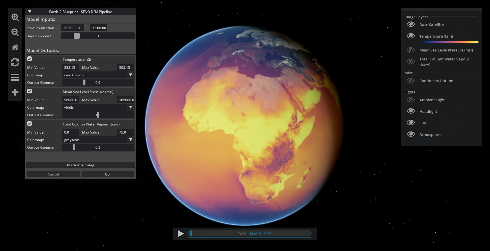
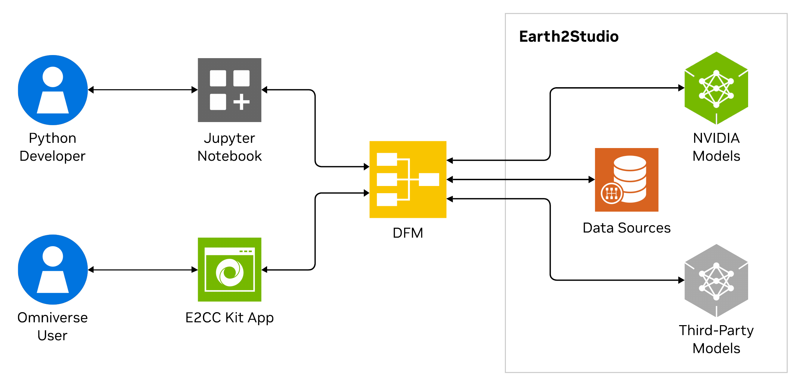

<!-- markdownlint-disable  MD013 -->
#  Earth-2 Weather Analytics Blueprint
<!-- markdownlint-enable MD013 -->

<div align="center">



</div>

The Earth-2 Weather Analytics Blueprint is a reference implementation of a
geospatial data analysis service built from key components of NVIDIA's
[Earth-2](https://www.nvidia.com/en-us/high-performance-computing/earth-2/)
platform. It provides a starting point to build your own weather-related
workflows accelerated by AI and Omniverse. The blueprint demonstrates three
integrated components:

1. [NVIDIA Data Federation Mesh (DFM)](https://github.com/NVIDIA/data-federation-mesh)
   for orchestrating distributed data processing workflows.
2. [NVIDIA Earth2Studio](https://github.com/NVIDIA/earth2studio) for running
   AI-driven weather inference workflows inside DFM pipelines.
3. Earth-2 Command Center (E2CC), an
   [NVIDIA Omniverse](https://www.nvidia.com/en-us/omniverse/) Kit application
   for high-fidelity visualization of geospatial data.

<div align="center">
<div align="center" style="max-width: 800px;">



</div>
</div>

## Overview

How the blueprint fits together: clients submit *pipelines* (graphs of
operations) to a *federation*. The DFM runs them on *sites* and returns the
results.

### What is the Data Federation Mesh (DFM)?

The [Data Federation Mesh (DFM)](https://github.com/NVIDIA/data-federation-mesh)
is a programmable framework for orchestrating data processing across distributed
*sites*. Each site is a group of services and resources in one location. DFM
acts as "glue code as a service" as it coordinates where work runs and how data
flows. It brings compute to the data by running pipeline steps close to where
data lives to reduce latency, bandwidth, and cost, and helps keep data within
desired security boundaries. Multiple sites form a *federation* and expose a
single, coherent API so clients can submit pipelines without knowing the
underlying topology.

### Two Ways to Run This Blueprint

This blueprint demonstrates two workflows for defining and submitting pipelines
to the DFM:

- **Jupyter notebook**: For Python developers. Connect to DFM, build a pipeline
  from the federation’s operations API, execute it on DFM sites, and pull
  results back into the notebook for analysis.
- **Earth-2 Command Center (E2CC)**: The same pattern from an Omniverse Kit app.
  Define and run pipelines from within a digital twin environment and visualize
  results on an interactive 3D globe.

In both cases, the client (notebook or E2CC) sends a pipeline to the federation,
DFM runs it and returns results.

### Role of Earth2Studio in This Blueprint

Pipeline operations on each site are implemented by *adapters*, which are
plugin-like components that perform the actual work. In this blueprint, some of
those adapters use the [NVIDIA Earth2Studio](https://github.com/NVIDIA/earth2studio)
toolkit under the hood. Earth2Studio is a comprehensive toolkit for AI weather inference
workflows. It provides a unified API for weather data sources, NVIDIA's in-house
weather models, as well as third-party models. When a client submits a weather
pipeline, the site's adapters call into Earth2Studio to load data and run inference.

In practice, DFM adapters are much more general and not limited to weather. They
can implement any operation a federation needs. This blueprint uses Earth2Studio
because it focuses on AI weather workflows.

### Scope of This Blueprint

To keep the setup simple, this blueprint runs in *DFM Proof of Concept (POC)
mode*, where all sites run on a single machine. This allows you to try the full
flow without deploying a distributed federation.

In production, a federation can span multiple, independently managed sites on
different machines, regions, clouds, or on-premises data centers. Each site
administrator controls what their site offers and DFM orchestrates execution
across sites, assigns operations to capable sites, and manages data flow. The
DFM provides one API over a distributed, heterogeneous mesh while keeping data
and control where each organization intends.

<div align="center">
<div align="center" style="max-width: 800px;">



</div>
</div>

## Getting Started

This repository is specifically designed for developers.
Follow these steps to clone the repository:

```bash
git lfs install

git clone git@github.com:NVIDIA-Omniverse-blueprints/earth2-weather-analytics.git
cd earth2-weather-analytics
```

Use the blueprint guide to build and deploy the blueprint on your machine.

- [Quickstart](./docs/01_quickstart.md)
    - [Prerequisites](./docs/01_quickstart.md#prerequisites)
    - [Setup](./docs/01_quickstart.md#setup)
    - [Usage](./docs/01_quickstart.md#usage)
- [Earth-2 Command Center](./docs/02_omniverse_app.md)
    - [Overview](./docs/02_omniverse_app.md#overview)
    - [Developer Guide](./docs/02_omniverse_app.md#developer-guide)
- [Data Federation Mesh](./docs/03_data_federation_mesh.md)
    - [Overview](./docs/03_data_federation_mesh.md#overview)
    - [Developer Guide](./docs/03_data_federation_mesh.md#developer-guide)

## License

The Earth-2 Weather Analytics Blueprint is provided under the Omniverse License
Agreement. Refer to [LICENSE.md](./LICENSE.md) for the full license text.

### Deployment Disclaimer

The NVIDIA Earth-2 Weather Analytics Blueprint is shared as a reference and is
provided "as is". The security of the production environment is the
responsibility of the end users deploying it. When deploying in a production
environment, have security experts review any potential risks and threats. In
particular:

- Define the trust boundaries.
- Implement logging and monitoring capabilities.
- Secure the communication channels.
- Integrate AuthN and AuthZ with appropriate access controls.
- Keep the deployment up to date.
- Ensure the containers and source code are secure and free of known vulnerabilities.
