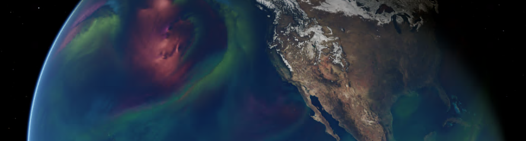

<!-- markdownlint-disable  MD013 -->
#  Earth-2 Weather Analytics Blueprint
<!-- markdownlint-enable MD013 -->

<div align="center">



</div>

The Earth-2 Weather Analytics Blueprint is a reference implementation of a geospatial
data analysis service comprising multiple features from NVIDIA's Earth-2 platform.
This repository provides a starting point for you to build your
own weather / climate systems accelerated by AI and Omniverse.
This blueprint will demonstrate the following core features and their integration to
create a complete weather analytics service:

1. Using the Nvidia Omniverse platform to aggregate and visualize data at scale
1. Deploying and scaling AI weather models through
   *[Nvidia Inference Microservices](https://docs.nvidia.com/nim/index.html#earth-2)
   (NIMs)*
1. Using components of the Nvidia Earth-2 platform to implement an adapter framework
   that connects to partner and public data stores

<div align="center">


</div>

## Core Components

- *Earth-2 Command Center (E2CC)*: An Omniverse Kit application with extensions that
  enable visualization of geo-spatial data. This is the front-end of the blueprint.
- *Data Federation Mesh (DFM)*: Glue code or orchestration layer that processes
  pipelines from different data stores. Connects the different data sources to E2CC and
  runs the needed pipelines to generate textures.
- *FourCastNet NIM (FCN NIM)*: An AI weather model, packaged as an Nvidia Inference
  Microservice, for global weather forecasting.

## Getting Started

This repository is specifically designed for developers.
Follow these steps to clone the repository:

```bash
git lfs install

git clone git@github.com:NVIDIA-Omniverse-blueprints/earth2-weather-analytics.git
cd earth2-weather-analytics

# just in case
git lfs fetch --all
```

Use the blueprint guide to build and deploy the blueprint on your infrastructure.
This guide requires intermediate knowledge of Python, Docker,
and beginner knowledge of Kubernetes / Helm Charts.

- [Workflow Overview](./docs/00_workflow.md)
- [Prerequisites](./docs/01_prerequisites.md)
  - [Software](./docs/01_prerequisites.md/#software)
  - [Hardware](./docs/01_prerequisites.md?ref_type=heads#hardware)
- [Quickstart](./docs/02_quickstart.md)
- [Deployment Guide](./docs/03_microk8s_deployment.md)
- [Earth-2 Command Center Guide](./docs/04_omniverse_app.md)
- [Data Federation Mesh Guide](./docs/05_data_federation_mesh.md)
- [Sequence Diagram](./docs/06_sequence.md)
- [Troubleshooting](./docs/07_troubleshooting.md)

## Sample Visualizations

Below are a few samples of what the following blueprint can produce.

<div align="center">

| Multivariant Analysis | Regional Data | RTX Rendered |
|:-----------------:|:-------------:|:-------------:|
|  |  |  |

</div>

## License

The Earth-2 Weather Analytics Blueprint is provided under the Omniverse License
Agreement, please see [LICENSE.md](./LICENSE.md) for full license text.

### Deployment Disclaimer

The Earth-2 Weather Analytics Omniverse Blueprint is shared as reference and is provided
"as is". The security in the production environment is the responsibility of the end
users deploying it. When deploying in a production environment, please have security
experts review any potential risks and threats; define the trust boundaries, implement
logging and monitoring capabilities, secure the communication channels, integrate AuthN
& AuthZ with appropriate access controls, keep the deployment up to date, ensure the
containers/source code are secure and free of known vulnerabilities.
