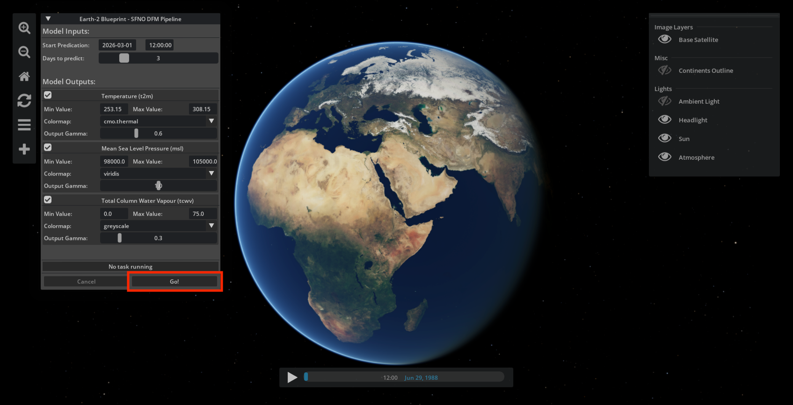

# Quickstart

This guide walks you through building and running the Earth-2 Weather Analytics Blueprint.

## Prerequisites

Your environment must meet the following software and hardware requirements.

### Software

The following software is required for deployment and development of the blueprint:

- **OS**: Ubuntu 22.04
- **Python**: 3.12
- **NVIDIA driver**: ≥580.105
- **CUDA**: 13.0
- [Git Large File Storage (LFS)](https://git-lfs.com/)
- [uv](https://docs.astral.sh/uv/getting-started/installation/) (Python package manager)
- [Docker](https://docs.docker.com/engine/install/ubuntu/)
- [NVIDIA Container Toolkit](https://docs.nvidia.com/datacenter/cloud-native/container-toolkit/install-guide.html)

Verify that Docker can use the NVIDIA runtime:

```bash
docker run --rm --runtime=nvidia --gpus all ubuntu nvidia-smi
```

### Hardware

To run the full blueprint on a single workstation, NVIDIA recommends the following:

- **GPU**: NVIDIA RTX 6000 Ada / NVIDIA RTX PRO 6000 / NVIDIA RTX PRO 5000
- **CPU**: 32 cores
- **RAM**: 64 GB
- **Storage**: ≥128 GB NVMe SSD

Running the Earth-2 Command Center (E2CC) Kit application with the
**Data Federation Mesh (DFM)** site requires an RTX-enabled GPU with at least
**48 GB VRAM**. The GPUs in the preceding list meet this requirement.
Refer to [Omniverse Technical Requirements](https://docs.omniverse.nvidia.com/dev-guide/latest/common/technical-requirements.html)
for additional details.

If you use only the **notebook workflow** (no Omniverse/E2CC), an NVIDIA GPU
with at least **40 GB VRAM** is sufficient, and it does not need to be
RTX-enabled.

## Setup

From the repository root, run:

```bash
./setup.sh
```

This script:

1. **Builds the Earth-2 federation Python packages:** a *site* wheel for the
   DFM site container (executes pipelines and includes all dependencies for the
   adapters, including Earth2Studio) and a lighter *client* wheel for the
   notebook and E2CC to define and submit pipelines.
2. **Builds the Earth-2 Command Center (E2CC) Kit application.** You can remove
   this step from the setup script if you do not need the Omniverse workflow.
3. **Creates the Python environment** for the Jupyter notebook workflow
   (`.venv-notebook`). Run `sudo apt install python3.12-venv` if the script
   fails to set up the virtual environment.

Before using either the Jupyter notebook or the E2CC application, start the DFM
site. In a new terminal, from the repository root, run:

```bash
./src/run_container.sh
```

This starts a container that runs the **DFM site**. This site receives pipelines
from the notebook or E2CC, executes them, and returns the results.

> [!NOTE]
> The first time you submit a pipeline, results can take longer while the DFM site
> downloads the SFNO model weights.

## Usage

The blueprint includes example pipelines that:

1. Fetch weather data from the **Global Forecast System (GFS)**.
2. Run a forecast with the **Spherical Fourier Neural Operator (SFNO)** model.
3. Convert the output to uint8 and generate images per timestep.

You can run these pipelines from the **Jupyter notebook** or from the
**Earth-2 Command Center** Kit application.

### Jupyter Notebook Workflow

1. Open `example_pipeline.ipynb` and select the `.venv-notebook` kernel.
2. Run the cells in order. The notebook connects to the DFM site, builds a
   pipeline from the federation API operations, submits it for execution, and
   displays the returned forecast images.

### Earth-2 Command Center (E2CC) Workflow

To launch the E2CC Kit application, from the repository root run:

```bash
./earth-2-command-center/_build/linux-x86_64/release/omni.earth_2_command_center.app.sh
```

> [!NOTE]
> Launch E2CC from the repository root. E2CC resolves the Flare workspace path
> (used for DFM in proof of concept (POC) mode) relative to the directory from
> which you start it.

The Earth-2 Weather Analytics application opens with an interactive globe and a
blue marble base layer.

> [!NOTE]
> The first launch can take several minutes while the application compiles
> shaders.

To submit the example pipeline, select **Go!** in the
**Earth-2 Blueprint - SFNO DFM Pipeline** panel. If you encounter an error,
select **Go!** again. The error can be related to the initial download of the SFNO
model weights.

When the task finishes, the results appear on the globe. Use the **Layers** panel to
toggle layers and the **Timeline** control to move through the forecast timesteps.

<div align="center">
<div align="center" style="max-width: 800px;">



</div>
</div>

<!-- Footer Navigation -->
---
<div align="center">

| Previous | Next |
|:---------:|:-----:|
| [README](../README.md) | [Earth-2 Command Center](./02_omniverse_app.md) |

</div>
