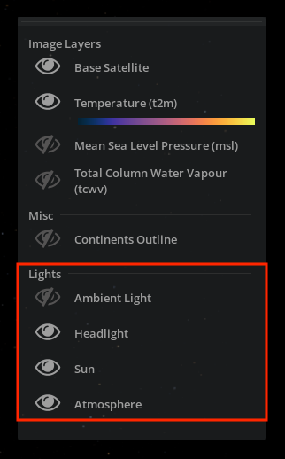
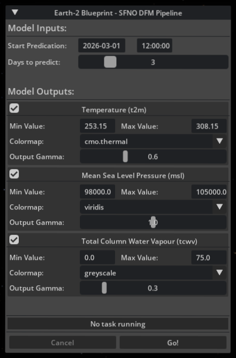
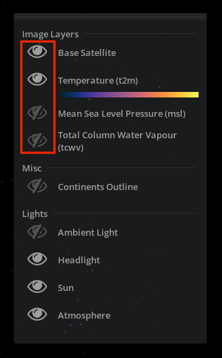
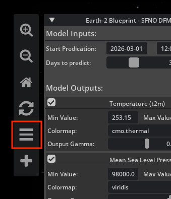
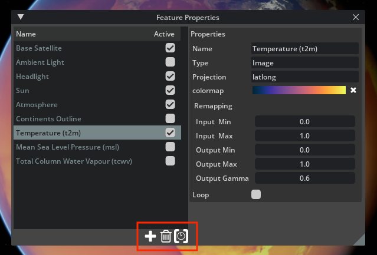

# Earth-2 Command Center

Earth-2 Command Center (E2CC) is one of two DFM clients in the Earth-2 Weather
Analytics Blueprint. It is an Omniverse Kit application and serves as a
reference for building similar applications.

## Overview

This section gives you an introduction to:

- the user interface for the Kit app
- how to control the camera and the lights
- how to add and remove features

### Controlling the Camera

You control the camera through left and right
mouse button click-and-drag gestures. The camera tumbles around the globe in a
turntable fashion and modulates tumble and zoom speed based on altitude:

- To tumble the camera around the globe, **hold the Left Mouse Button and drag**.
- To get closer to or further away from the globe,
**hold the Right Mouse Button and drag**.

The camera interaction in this reference application differs from the default Kit
camera.
It is implemented as a custom gesture manager in:

```bash
earth-2-command-center/source/extensions/omni.earth_2_command_center.app.globe_view/omni/earth_2_command_center/app/globe_view/globe_camera.py
```

### Controlling Lights

There are multiple predefined lights:

- **Sun**: A strong directional light that illuminates one side of the globe and
  leaves the other in the dark.
- **Headlight**: A dim light illuminating the globe from the direction of the camera.
  This makes sure the dark side of the globe gets some illumination.
- **Ambient Light**: A strong omni-directional light that uniformly illuminates
  the whole globe. This is useful when we want to see the raw data and not have
  lighting distracting from it.
- **Atmosphere**: Not technically a light, but currently controlled as if it is a light.
  Toggling this feature toggles the blue atmospheric scattering from the
  rendering.

The application tries to switch between different configurations intelligently
to simplify things for you. For example, turning off the sun light will switch
to ambient light and conversely.

Each light source is a Feature of its own, created and managed by the Globe View
extension in:

```bash
earth-2-command-center/source/extensions/omni.earth_2_command_center.app.globe_view/omni/earth_2_command_center/app/globe_view/extension.py
```

<div align="center">
<div style="max-width: 300px;">



</div>
</div>

### Adding and Removing Visualization Features

Visualization features are like layers that can be added to the current
visualization canvas. There are different feature types like image sequences,
lights, geometry, lines, and volumetrics.

### DFM Pipeline Panel

The **Earth-2 Blueprint - SFNO DFM Pipeline** panel lets you submit the example
pipeline and view the results on the globe.

**Model Inputs**

- **Start Prediction**: The date and time for forecast initialization. Invalid
  dates trigger an error and are reset to the nearest valid date. Time should be
  one of 00:00:00, 06:00:00, 12:00:00, or 18:00:00.
- **Days to predict**: How many days to forecast. Each day adds four time steps
  (six hours apart).

**Model Outputs**

- **Variables**: Check the boxes next to each variable name to choose which
  forecast variables will be used for visualization.
- **Min Value / Max Value**: For each variable, the range used to normalize the
  data before visualization.
- **Colormap**: The colormap applied to the resulting images.
- **Output Gamma**: Gamma correction for the output images. It adjusts
  brightness through a nonlinear intensity transformation.

<div align="center">
<div style="max-width: 400px;">



</div>
</div>

### Active Features Dialog

All features present in the stage are listed in the window at the top-right
corner of the screen.
Clicking the **eye symbols** toggles the visibility of the individual features.

<div align="center">
<div style="max-width: 300px;">



</div>
</div>

### Feature Properties Window

The **Feature Properties** window gives additional controls over features. Open
this window by clicking on the features button in the left menu.

<div align="center">
<div style="max-width: 400px;">



</div>
</div>

This window allows you
to change properties of the features, and it allows you to add and remove features
through the **plus (+)** and **trash buttons** at the bottom. The **clock button**
focuses the timeline on the selected feature.

<div align="center">
<div style="max-width: 600px;">



</div>
</div>

*To add a new feature*, click the **plus (+) button** which opens a list of features.
The content of this list depends on the extensions that are loaded, so this might
look different depending on your setup. Click to select the one you want to add.
You can also select **Add features from metadata file** to open a file browser and
select JSON files that describe E2CC visualizations.

*To remove a feature*, **click** the feature in the **list of available features**
on the left side of the **Feature Properties** window. Then click the **trash button**
at the bottom and confirm the dialog. You can delete multiple features at once by
selecting multiple features. Just hold the **CTRL key** when clicking to add to
the current selection.

### Image Feature Remapping

The application exposes several settings of the visualization features in the
**Feature Properties** window. This allows you to change how things are visualized at runtime. The
controls exposed on `Image` type features are:

- **Output Gamma**: This is the most useful of all these controls. It controls
  how the mid-tones are mapped to the output. Lower values will give more
  contrast, while higher values give more details in the dark areas. This is very
  useful when exploring the data interactively.
- **Colormap**: The input data can be mapped to a color through one of the
  many available colormaps. This can be used to map a temperature value (monochrome)
  to color such that low temperatures are mapped to cold colors and hot temperatures
  to warm colors.
- **Input In, Input Max**: This is rarely needed if the input data is well formed.
  Mathematically, we map [a,b] to [0,1]. Imagine you have input data that only
  reaches half grey. By setting Input Max to 0.5, we can make sure that further
  remapping will use the full range and colormaps will use all colors. Another
  use case is data which never reaches black. This is where increasing Input Min
  can help.
- **Output Min, Output Max**: Mathematically, we map [0,1] to [a,b]. The main
  situation this is used is to make a layer more bright. For clouds, Output Max
  can be set higher than 1 to make them appear whiter.

Other feature types also expose controls. For example, the name of all features
can be changed.
For the Sun feature, you can turn on the animation of the sun.

Examples for adding Features programmatically, as well as the implementation of
JSON-based Feature creation, can be found in the Test Sequence extension:

```bash
earth-2-command-center/source/extensions/omni.earth_2_command_center.app.test_sequence/omni/earth_2_command_center/app/test_sequence
```

### Managing the Timeline

The timeline at the bottom of the application window shows the current time in UTC.
When there are features present that cover a certain time span, they will be
illustrated by a blue line below the timeline. When loading features, it is possible
that you load data from time spans that are far apart. This makes it impractical to
have one timeline covering the time spans of all features. For this reason, we allow
you to focus the timeline on specific features.

In the **Feature Properties** window, there is a **button with a clock
icon**. Clicking this button with a feature selected will show a
dialog that allows you to set a new playback duration. After you confirm, the
timeline will be set to cover the time span of the selected features and scaled
such that the playback will cover the duration specified in the dialog.

The timeline is separate from the USD timeline. UTC time is mapped to USD time
codes by the Time Manager in:

```bash
earth-2-command-center/source/extensions/omni.earth_2_command_center.app.core/omni/earth_2_command_center/app/core/time_manager.py
```

Features that represent time-varying data can subscribe to the `UTC_*_CHANGED`
events.

## Developer Guide

This section is for developers who want to understand the codebase and extend the
application.
The Kit app follows a standard directory structure common to Omniverse Kit Applications.
The unique functionality of E2CC is implemented in the form of Kit extensions.
For general questions about app and extension development, or about the directory
structure and the build system, refer to the [Omniverse Kit documentation](https://docs.omniverse.nvidia.com/kit/docs/kit-manual/latest/index.html).

### The Concept of Features

A core concept of the Kit app is the separation of the data being visualized from
the actual visible representation.
A particular piece of data, combined with a description of how it is to be visualized,
is called a *feature*.

While we have features (examples: a satellite image covering a specific
region, or a time series of a scalar quantity with an associated colormap), the
RTX renderer requires geometry, materials, and assets to produce the
rendered results. To this end, E2CC maintains a USD stage that
represents the input to the RTX renderer.

You can create your own features programmatically as part of an
Omniverse Kit Extension invoking the Features API implemented in:

```bash
earth-2-command-center/source/extensions/omni.earth_2_command_center.app.core/omni/earth_2_command_center/app/core/features_api.py
```

or by providing a metadata file (refer to the following sections).
The Kit app showcases how multiple such Features are managed
simultaneously.

Features describing a two-dimensional field, represented by textures, are
composited at render time using a shader graph. This graph is modified and (if
needed) rebuilt as Features are added and removed. Changing attributes of a
Feature typically results in changes to parameters of the corresponding shader
node. The Shading extension is responsible for managing the shader graph:

```bash
earth-2-command-center/source/extensions/omni.earth_2_command_center.app.shading
```

Features that describe geometry (for example continent outlines) are treated
separately. These geometry Features are typically mapped to USD Prims in the
stage, as illustrated by the Example Extension:

```bash
earth-2-command-center/source/extensions/omni.earth_2_command_center.app.example_extension
```

### Metadata Format

The Kit app can load feature descriptions from metadata stored in JSON files. The goal
for this representation is to make it usable for other applications outside of
the Kit app without introducing a requirement for the USD libraries. In the future, this
mechanism can be augmented by adding a USD schema.

The following sections describe how the metadata JSON files can be structured.

### High-Level Structure

On the first level, the JSON file can define:

- **features**: a **list** of feature definitions that will be loaded when importing
  the JSON file
- **imports**: a **list** of import definitions that allow you to reference other JSON
  files
- **options**: a **dictionary** of options that can specify playback and time
  settings

The definition of each of those is optional.

```json
{
  "features": [
    { ... feature 1 ... },
    { ... feature 2 ... },
             ...
  ],

  "imports": [
    {... import 1 ...},
    {... import 2 ...},
          ...
  ],

  "options": {
    "option1": value1,
         ...
  }
}
```

### Feature Definitions

A single feature definition defines the properties of the visualization feature.
This means that the available properties depend on the feature type. Currently,
animated properties are only supported for a small subset of properties (sources,
alpha_sources) but this will be extended. In the meantime, custom extensions are
free to animate any property.

### Common Properties

These are properties supported by all feature types:

- `name` (string): display name of the feature
- `active` (bool): whether the feature is visible or not
- `type` (string): type of the feature (Image, Curves, ...)
- `meta` (dict): metadata of the feature

### Image Feature Properties

These are properties supported by Image features:

1. `projection` (string): projection of the image:
   - `latlong`: lat-lon image in WGS84. We also support latlong splits (mosaics)
     but we do not expose this feature yet in the metadata format. These are
     mostly used to support very high resolution textures that exceed the limit of
     the renderer.
   - `diamond`: ICON Diamond Decomposition. Requires 10 files to be specified for
     each source
   - `goes`: NOAA GOES CONUS projection. Requires `x_range`, `y_range` and
     `perspective_point_height` to be specified in the meta field. The
     `longitudinal_offset` is used for the longitude of the satellite.
   - `goes_disk`: NOAA GOES Full Disk projection. Requires
     perspective_point_height to be specified in the meta field. The
     longitudinal_offset is used for the longitude of the satellite.
   - `longitudinal_offset` (float): Offset **in radians** from the prim meridian.

2. `colormap` (string): name of the colormap to be used for the color transfer
   function

3. `flip_u`, `flip_v` (bool): When enabled, the images will be flipped
   horizontally or vertically, respectively.

4. `remapping` (dict): dictionary defining the image remapping properties
   - `input_min`, `input_max` (float): remaps the input from `[input_min,
     input_max]` to `[0,1]`
   - `output_min`, `output_max` (float): remaps the output to `[output_min,
     ouput_max]`
   - `output_gamma` (float): applies a gamma remapping to the output

5. `sources`, `alpha_sources` (list[string]/dict): defines the source file/files
   to display.
   - A static dataset is set up by providing a **list** of paths. For a latlong
     image, this would be a list of a single path, for a diamond image, this
     would be a list of 10 paths (one for each diamond).
   - For animated datasets, this needs to be a dictionary mapping isoformat
     datetimes to lists of paths
   - `latlon_min`, `latlon_max` (list[float]): only used when projection is a
     latlong variant. Both latlon_min and latlon_max take a list of 2 entries
     which specifies a rectangular subregion in latlon (**in degrees**). The
     image is then mapped affinely to that subregion.

### Masking Note

When you define a `sources` property and use `latlon_min`, `latlon_max` to map
this image affinely to a latlon subregion, the area outside of the image will be
opaque.
You have to provide an `alpha_sources` mask in order to visualize the
outside region as transparent.

> [!NOTE] It is valid to specify an empty string as an `alpha_source`.

```json
{
    "features": [
        {
            "name": "Cloud Coverage",
            "type": "Image",
            "projection": "latlong",
            "alpha_sources": {
                "2023-08-14T10:00:00": "./jpegs/500m_cloud_0.jpeg",
                ...
                "2023-08-14T18:00:00": "./jpegs/500m_cloud_1440.jpeg"
            },
            "latlon_min": [ 43.1, 4.0 ],
            "latlon_max": [ 49.596, 14.496 ],
            "remapping": {
                "input_min": 0.2,
                "input_max": 1.0,
                "output_min": 0.0,
                "output_max": 2.0,
                "output_gamma": 0.7
            }
        }
    ]
}
```

### Curves Feature Properties

Curves features are only partly implemented and will be extended in the future.
Currently, you can define curves with vertices in WGS84, which are then projected
into earth centric coordinates for visualization.

These are properties supported by Curves features:

1. `projection` (string): projection of the image:
   - `latlong`: 2d WGS84 coordinates (**in degrees**)
   - `latlongalt`: 2d WGS84 coordinates (**in degrees**) plus altitude over
     surface.
2. `color` (list): list with 3 entries defining the RGB ([0,1] range in float)
   color of the curves (constant for all curves for now)
3. `width` (float): width of the curves (constant for all curves for now)
4. `periodic` (bool): whether the curves should get closed (connected to starting
   vertex)
5. `points` (list): list of lists with 2 (latlong) or 3 (latlongalt) entries
   defining the coordinates of the vertices.
6. `points_per_curve` (list): list of integers defining the number of vertices
   per curve.

```json
{
    "features": [
        {
            "name": "Data Bounds",
            "type": "Curves",
            "projection": "latlonalt",
            "color": [1,0,0],
            "periodic": false,
            "width": 2,
            "points": [
                [ 43.1, 5.0496, 2.0 ],
                ...
                [ 43.1, 13.4464, 2.0 ]
            ],
            "points_per_curve": [ 3, 3, 3, 3 ]
        }
    ]
}
```

### Import Definitions

Imports are useful to easily assemble features from other metadata files. To
include the features from another JSON file `other.json` we can use:

```json
{
    "imports": [
        {"path":"./other.json"}
    ]
}
```

This will include all features defined in the imported JSON file. The **imports**
definition is a list, so that you can list multiple imports. It is also
possible to override feature properties when importing them. Currently, an
override is applied to all the imported feature.
This can be used to import features from other JSONs but make them invisible
by default:

```json
{
  "imports": [
      {"path":"./other_1.json", "overrides":{"active":true}},
      {"path":"./other_2.json", "overrides":{"active":false}},
      {"path":"./other_3.json", "overrides":{"active":false}},
      {"path":"./other_4.json", "overrides":{"active":false}}
  ]
}
```

### Option Definitions

Options can be used to change time and playback settings. Options from imports are
ignored. The following properties are supported:

- `playback_duration` (float): After all features have been imported, the time
  range will be extended to include all features. The duration of the playback is
  set to 10 seconds by default but can be overridden with this setting.
- `utc_start_time`, `utc_end_time` (string): Start and End time as UTC ISO Format
  of the playback.
- `play` (bool): When set to true, the playback is started after the file has
  been imported.

```json
{
  "imports": [
      {"path":"./other_1.json", "overrides":{"active":true}},
      {"path":"./other_2.json", "overrides":{"active":false}},
      {"path":"./other_3.json", "overrides":{"active":false}},
      {"path":"./other_4.json", "overrides":{"active":false}}
  ],
  "options": {
      "playback_duration":5,
      "play":true
  }
}
```

### Just-In-Time Decoded Image Sequences

The ability to smoothly cycle through large sequences of 2D data, such as global
ICON time series, is achieved by representing the data as JPEG-encoded images,
which are cached and decoded on the GPU. The underlying mechanism for this is
implemented in the Dynamic Texture extension, which is a dependency of E2CC. Image
sequences defined through JSON metadata automatically make use of this
functionality.

Programmatically created Features have to invoke the Dynamic Texture interface.

Examples can be found in the Test Sequences extension:

```bash
earth-2-command-center/source/extensions/omni.earth_2_command_center.app.test_sequence
```

### Adding Custom Feature Types

The Kit app source tree includes an example extension that can
serve as a starting point for custom Feature types:

```bash
earth-2-command-center/source/extensions/omni.earth_2_command_center.app.example_extension
```

Its implementation consists of the following components:

- `extension.py`: A Kit extension that demonstrates the setup, including Feature
  type registration and event subscription, as well as teardown on shutdown.
- `custom_feature.py`: A Feature specification that represents a single
  geographical location and a color.
- `custom_feature_delegate.py`: A Feature delegate that reacts to events
  concerning the Feature (for example, changes of properties and visibility),
  and manages updates to the Feature's visual representation.

You can make your own copy of this extension and adapt it to your needs.

<!-- Footer Navigation -->
---
<div align="center">

| Previous | Next |
|:---------:|:-----:|
| [Quickstart](./01_quickstart.md) | [Data Federation Mesh](./03_data_federation_mesh.md) |

</div>
