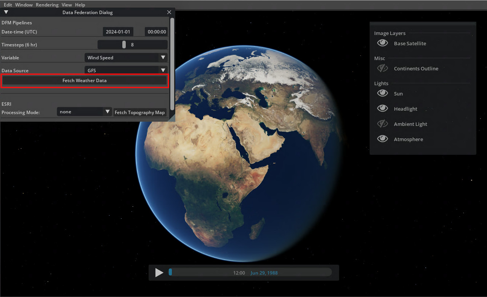
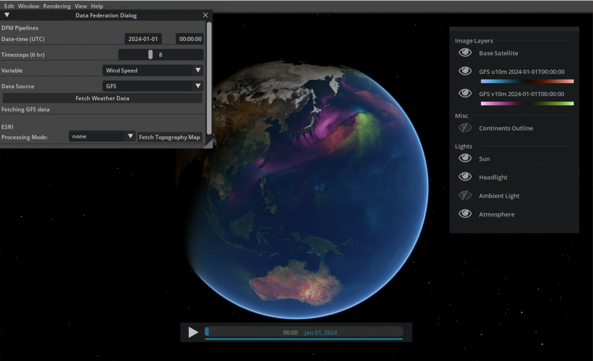
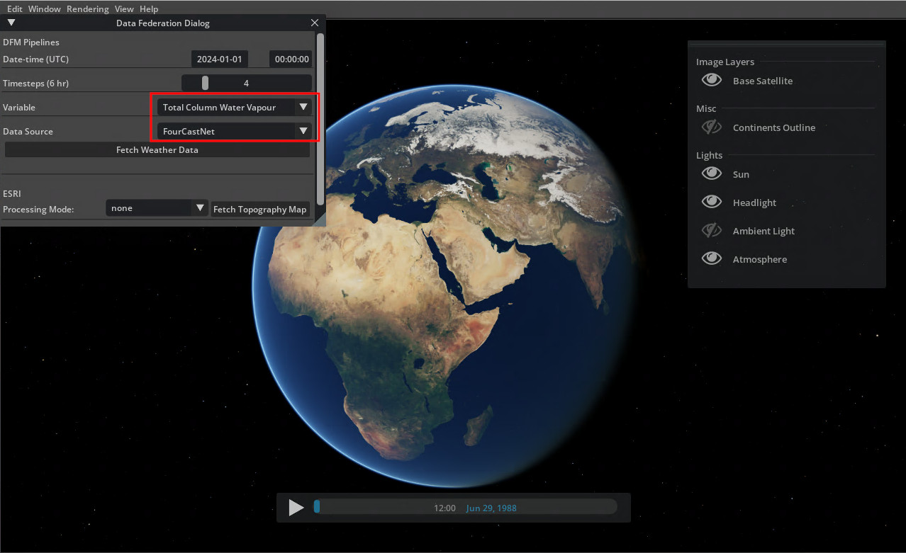

# Earth-2 Weather Analytics Blueprint - Quickstart

You will use this quickstart guide to build and deploy the Earth-2 Weather Analytics
blueprint on MicroK8s and run the application in desktop mode.
In subsequent [sections](./03_microk8s_deployment.md), the deployment process and
relevant options will be covered in detail.

> [!NOTE]
> This quickstart guide assumes that you have already followed the [prerequisites](./01_prerequisites.md).

## Building and Deploying Data Federation Mesh and FourCastNet NIM

To quickly deploy the blueprint backend on MicroK8s, run:

```bash
./deploy/deploy_microk8s.sh
```

This script will:

1. Build required Docker images (if not already built)
1. Attempt to create NGC and ESRI secrets if environment variables are defined
1. Enable necessary MicroK8s addons
1. Deploy the application using Helm
1. Verify the deployment

The script supports the following options:

- `-f, --force`: Force rebuild of Docker images
- `-w, --wait`: Wait for all pods to be ready
- `-c, --cache-path PATH`: Set custom cache directory path
- `-n, --no-nim`: Disable NIM deployment (recommended for first deployment, non-NVAIE)
- `-h, --help`: Show help message
- `--skip-build`: Skip building docker images

> [!WARNING]
> The initial build and import process to MicroK8s can take some time to
> complete (sometimes up to an hour depending on your machine).
> Feel free to grab a coffee or tea while you wait.

On success, this should spin up the Data Federation Mesh and FourCastNet NIM (if active)
in microk8s.
To verify the deployment, list the active pods in the `earth2` namespace which should
produce a similar output:

```bash
kubectl get pods -n earth2

>>> NAME                                                 READY   STATUS    RESTARTS  AGE
>>> earth2-weather-analytics-execute-74fbfb967f-skc9b    1/1     Running   0         1m
>>> earth2-weather-analytics-nim-7c5b7bcdfc-wvtf4        1/1     Running   0         1m
>>> earth2-weather-analytics-process-7967c6b667-tlr8h    1/1     Running   0         1m
>>> earth2-weather-analytics-redis-master-0              1/1     Running   0         1m
>>> earth2-weather-analytics-redis-replicas-0            1/1     Running   0         1m
>>> earth2-weather-analytics-scheduler-8887b8b55-2srgz   1/1     Running   0         1m
```

## Building and Launching the Omniverse Kit Application

To quickly deploy the Omniverse application in a new console:

```bash
./deploy/deploy_e2cc.sh
```

This script will:

1. Build the Earth-2 Weather Analytics application
1. Launch the application in the specified mode

The script supports the following options:

- `-f, --force`: Force a clean rebuild the entire application
- `-d, --desktop`: Launch the desktop application (default)
- `-s, --streamer`: Launch the streamer application that exposes webRTC endpoints
- `-c, --cache-path PATH`: Set custom cache directory path
- `-h, --help`: Show help message

> [!WARNING]
> Watching the console logs is invaluable for Kit applications. You should
> keep the console visible while using Earth-2 Weather Analytics application to
> understand underlying processes.
> Upon initial launch the application will take several minutes to load while it
> compiles the necessary shaders. This is normal, monitor the console logs to confirm
> startup is running.

On success, this will open up the Earth-2 Weather Analytics application with an
interactive globe showing the blue marble base layer.

## Using the Weather Analytics Blueprint

Inside the Earth-2 Weather Analytics application, using the data window in the top left
corner, use the default settings to fetch wind speed data from the Global Forecast
System (GFS) model by clicking the **Fetch Weather Data** button:

<div align="center">
<div align="center" style="max-width: 575px;">



</div>
</div>

> [!NOTE]
> This may take several minutes to complete depending on your internet connection.

Once data is download it will be displayed on the globe.
Control the layers on the right and scrub through time using the timeline at the bottom.

<div align="center">
<div align="center" style="max-width: 575px;">



</div>
</div>

### Run an AI Weather Forecast

If the NIM is enabled, the FourCastNet NIM will be used to run an AI weather forecast.
Change the *Data Source* to `FourCastNet`, change *Variable* to
`Total Column Water Vapour`, and click the **Fetch Weather Data button** again.

<div align="center">
<div align="center" style="max-width: 575px;">



</div>
</div>

> [!NOTE]
> This may take several minutes to complete depending on your internet connection.
> FCN requires an initial state of about 400mb to be downloaded before inference, this
> will the bulk of the execution time.

Once the forecast is complete, the results will be added to the globe as a new layer.
Toggle the visibility between the GFS and FourCastNet layers to compare the predictions.

<!-- Footer Navigation -->
---
<div align="center">

| Previous | Next |
|:---------:|:-----:|
| [Prerequisites](./01_prerequisites.md) | [MicroK8s Deployment](./03_microk8s_deployment.md) |

</div>
