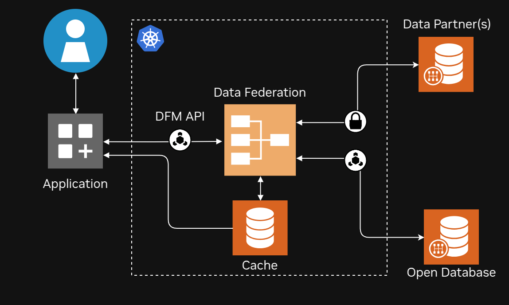
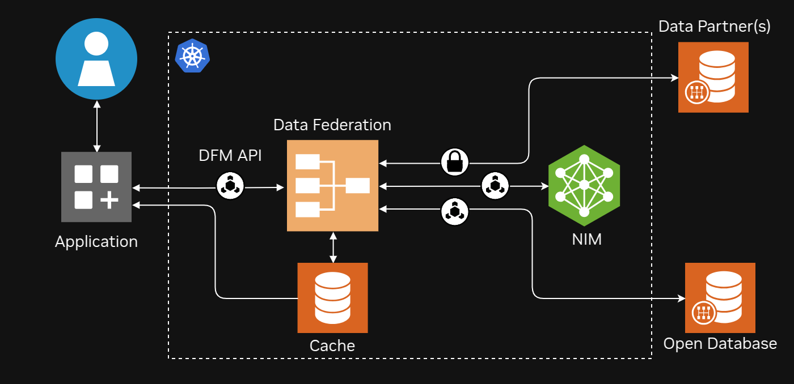
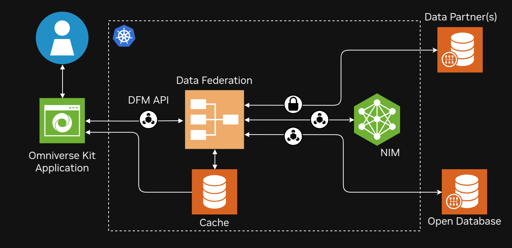
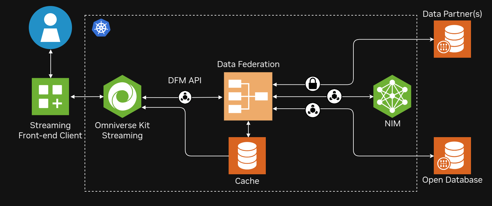

# Earth-2 Weather Analytics Blueprint - MicroK8s Deployment

This section describes the deployment of the Earth-2 Weather Analytics Blueprint on
MicroK8s in greater detail, discussing multiple configurations that may be of interest.

## Building Docker Images

Before deploying the blueprint, you need to build the custom Docker images for the
blueprint data federation services:

```bash
# Build images for Microk8s
./src/build_images.sh -k -f
```

The script supports the following options:

- `-k`: Build for MicroK8s environment
- `-f`: Force rebuild of images even if they exist
- `-h`: Show help message

This will build and import the following images into Microk8s:

- process:0.1.0
- execute:0.1.0
- scheduler:0.1.0
- redis/redis-stack-server:7.2.0-v11

## MicroK8s Deployment

The next section explains the process for deploying the blueprint using MicroK8s.

### Building Dependencies

If this is the first time deploying the blueprint, you will need to build the helm
charts and dependencies:

```bash
helm dependency build deploy/helm/
```

### Starting Kubernetes Dashboard (Optional)

Sometimes its useful to have a GUI to interact with the Kubernetes cluster.
Set up your K8s [dashboard](https://127.0.0.1:10443):

```bash
microk8s enable dashboard
kubectl create token default
kubectl port-forward -n kube-system service/kubernetes-dashboard 8003:443
```

### Deploying Data Federation Mesh (DFM) on MicroK8s

<div align="center">
<div style="max-width: 450px;">



 </div>
 </div>

Start by making a cache directory, the blueprint will use this for caching data and
textures.
Ensure that the processes in MicroK8s have read, write and execute access to this
location:

```bash
mkdir -p $(pwd)/cache
chmod 777 $(pwd)/cache
```

Deploy the blueprint services on MicroK8s using:

```bash
helm install -n earth2 earth2-weather-analytics deploy/helm/ \
    -f deploy/helm/values.dev.yaml \
    --set volumes[0].hostPath.path=$(pwd)/cache
```

To verify the deployment, port forward the blueprint process API:

```bash
kubectl -n earth2 port-forward service/earth2-weather-analytics-process 8080:8080
```

Test the deployment with:

```bash
curl localhost:8080/version
```

The [`src/pipelines/`](../src/pipelines/) directory contains a collection of scripts
that can be used to fetch data from the running DFM service entirely by using Python
APIs.
These pipelines link the Earth-2 Command Center to DFM to submit jobs to generate
textures for a given request.

### Deploying DFM and FourCastNet NIM on MicroK8s

<div align="center">
<div style="max-width: 500px;">



</div>
</div>

The blueprint helm chart has a feature to deploy the FourCastNet NIM as a an additional
microservice.
This allows the NIM to run alongside DFM to allow users to run AI weather
forecasts.
<!-- TODO somewhere here to explain more about DFM -->
The FourCastNet NIM is provided under the Nvidia AI Enterprise license.

First, add a valid [NGC API key](https://org.ngc.nvidia.com/setup/personal-keys)
as a secret in the MicroK8s cluster which will allow the NIM to pull the FourCastNet
model weights.

```bash
kubectl -n earth2 create secret generic ngc-catalog-secret \
    --from-literal=api-key=<your-api-key>
```

The blueprint can be deployed with both DFM and FourCastNet NIM by running the following
command:

```bash
helm install -n earth2 earth2-weather-analytics deploy/helm/ \
-f deploy/helm/values.dev.yaml \
--set nim.enabled=true \
--set volumes[0].hostPath.path=$(pwd)/cache
```

Note that the deployment of the NIM will take some time to complete since it will need
to pull both the container as well as the model weights.
Model weights can be cached locally on the machine to speed up the deployment.
Refer to the [FourCastNet NIM Documentation](https://docs.nvidia.com/nim/earth-2/fourcastnet/latest/configuring-nim-runtime.html)
for more information.

Port forward the blueprint process API:

```bash
kubectl -n earth2 port-forward service/earth2-weather-analytics-process 8080:8080
```

### Deploying Earth-2 Omniverse Kit Application

<div align="center">
<div style="max-width: 500px;">



</div>
</div>

Assuming one of the previous two deployments are successful and the DFM API port is
forwarded, the kit app can now be launched to use the running service.
To configure the kit app with the correct cache location set the
environment variable (update path as needed):

```bash
# Modify this one to your mounted location
export E2CC_CACHE_PATH=$(pwd)/cache
```

Next, in the E2CC repo build the E2CC application:

```bash
./e2cc/build.sh --release

./e2cc/_build/linux-x86_64/release/omni.earth_2_command_center.app_desktop.sh
```

The default endpoint for DFM is set to `https://localhost:8080` so running the app
should find the forwarded DFM process on port 8080.

### Deploying DFM K8s and kit app Streaming

<div align="center">
<div style="max-width: 550px;">



</div>
</div>

The next section contains the steps for deploying both DFM and kit app on MicroK8s and is
the most advanced deployment.

Note that this means kit app will be running in streaming mode, thus will need a streaming
client to interact with it.
**This streaming client is presently not included in this repository.**
We encourage users to look at the [WebRTC Browser Client Documentation](https://docs.omniverse.nvidia.com/extensions/latest/ext_livestream/webrtc.html)
to learn how to setup their own streaming client.

By default, the Omniverse Streaming Container isn't built since up to this point the
desktop application has been used.
The present base container requires an NVIDIA AI Enterprise license.
To build the Omniverse Streaming Container, run the following command in the E2CC repo:

```bash
./e2cc/build_images.sh -k
```

The same helm chart can be used for deploying the full blueprint:

```bash
helm install -n earth2 earth2-weather-analytics deploy/helm/
```

After a successful deployment, port forward the webRTC port:

```bash
kubectl -n earth2 port-forward service/streamer-entrypoint 49100:49100
```

The kit app webRTC stream will now be accessible on your `localhost` or `127.0.0.1`.
With a streaming client operational, the full blueprint demo present on the [NVIDIA API catalog](https://build.nvidia.com/)
will now be replicated on your local machine.

### Clean Up

Shut down the blueprint using:

```bash
helm uninstall earth2-weather-analytics -n earth2
```

To clean up the registry:

```bash
microk8s disable registry
microk8s disable storage:destroy-storage
microk8s enable registry
```

<!-- Footer Navigation -->
---
<div align="center">

| Previous | Next |
|:---------:|:-----:|
| [Quickstart](./02_quickstart.md) | [Omniverse App](./04_omniverse_app.md) |

</div>
