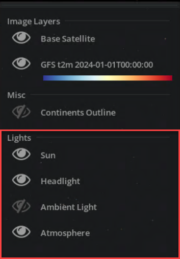
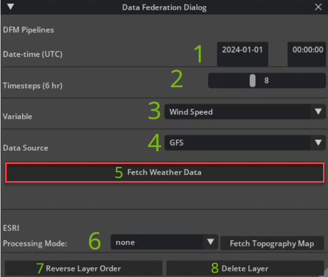
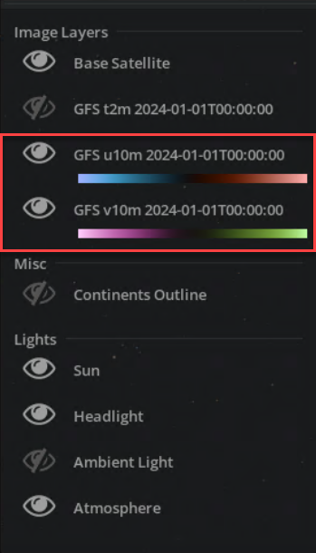
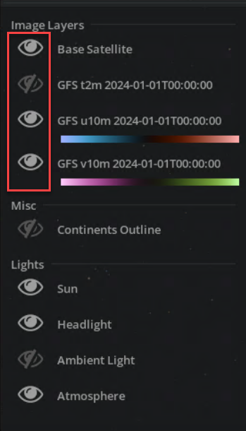
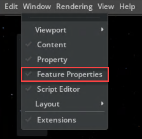
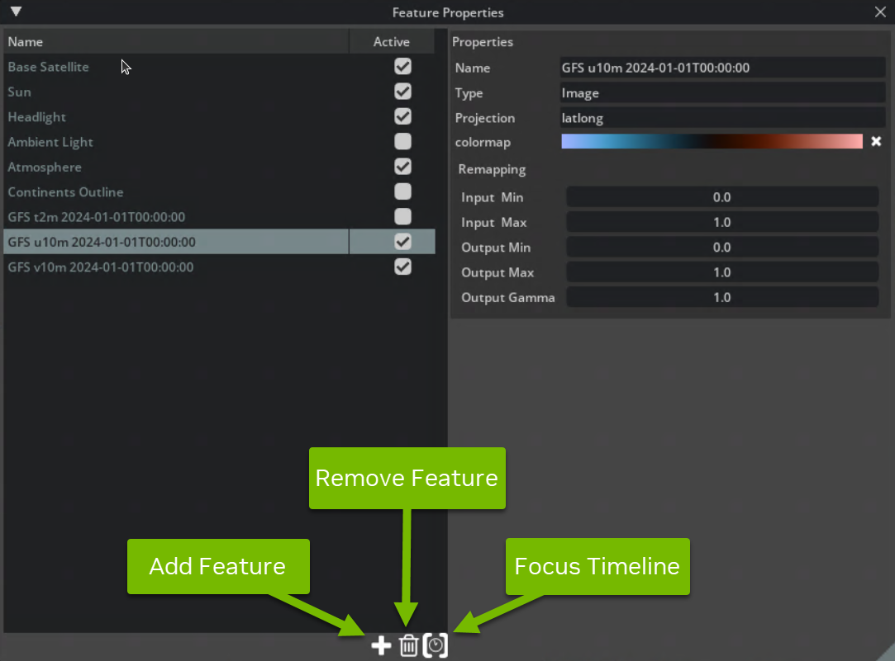

# Earth-2 Weather Analytics Blueprint - Earth-2 Command Center

The Earth-2 Weather Analytics Omniverse blueprint is a reference pipeline for a weather
analysis and forecasting application for interactive exploration and visualization
of terabytes of weather data coming from internal or external data archives.
At the front-end of the blueprint is the Omniverse Kit-based app, which serves as a sample for building similar applications.

## User Interface Guide

This section gives you an introduction to the user interface for the kit app, how to control
the camera and the lights, and how to add and remove features.

### Controlling the Camera

The camera is controlled through left and right
mouse button click & drag gestures, tumbling around the globe in a turntable
fashion while modulating tumble and zoom speed based on altitude:

- To tumble the camera around the globe, **hold the Left Mouse Button and drag**.
- To get closer to or further away from the globe,
**hold the Right Mouse Button and drag**.

The camera interaction in this reference application differs from the default Kit
camera.
It is implemented as a custom gesture manager in:

```bash
e2cc/source/extensions/omni.earth_2_command_center.app.globe_view/omni/earth_2_command_center/app/globe_view/gestures.py
```

### Controlling Lights

There are multiple predefined lights:

- **Sun**: A strong directional light that illuminates one side of the globe and
  leaves the other in the dark.
- **Headlight**: A dim light illuminating the globe from the direction of the camera.
  This makes sure the dark side of the globe gets some illumination.
- **Ambient Light**: A strong omni-directional light that uniformly illuminates
  the whole globe. This is useful when we want to see the raw data and not have
  lighting distracting from it.
- **Atmosphere**: Not technically a light but this is how it's currently controlled.
  Toggling this feature toggles the blue atmospheric scattering from the
  rendering.

The application tries to switch between different configurations intelligently
to simplify things for you. For example, turning off the sun light will switch
to ambient light and vice versa.

Each light source is a Feature of its own, created and managed by the Globe View
extension in:

```bash
e2cc/source/extensions/omni.earth_2_command_center.app.globe_view/omni/earth_2_command_center/app/globe_view/extension.py
```

<div align="center">
<div style="max-width: 300px;">



</div>
</div>

### Adding and Removing Visualization Features

Visualization features are like layers that can be added to the current
visualization canvas. There are different feature types like image sequences,
lights, geometry, lines, volumetrics, etc.

### Data Federation Dialog

Add new features to the stage using the *Data Federation Dialog* window.

1. Select a date in the past that you are interested in visualizing.
   This is the starting date and time that the fetched time-series will begin.
   The valid data times for each data source vary, governed by the data store and the
   time the data is accessed. Experiment to see what is available.
2. Set the number of timesteps you wish to have in the fetched time-series.
   Each timestep represents 6 hours of data, so the default value of 8 will provide 48
   hours of data on the timeline.
   For analysis data, this will provide subsequent observations at the respective time
   steps. For forecast data, this will provide forecast predictions generated by the
   model.
3. Now you can select from a set of different variables.
   What variables each data source can provide varies as well, so try different ones.
   If you are using the basic DFM deployment, try the default *Wind Speed* in the
   *Variable* field.
4. Select a data source to use.
   The UI provides several different data sources, each with their own unique properties
   to offer reference implementation for developers using different types of geospatial
   data.
   If you are using the basic DFM deployment, try the default *GFS* *Data Source*.

   The full set of Data Source options includes:
   - **GFS**: [Global Forecast System](https://www.ncei.noaa.gov/products/weather-climate-models/global-forecast)
     data which is continuously updated.
   - **ERA5**: [ECMWF Reanalysis v5](https://www.ecmwf.int/en/forecasts/dataset/ecmwf-reanalysis-v5)
     data that provides historical global weather data for several decades.
   - **HRRR**: [High-Resolution Rapid Refresh](https://rapidrefresh.noaa.gov/hrrr/) is a
     regional forecasting model over the United States.
   - **FourCastNet**: An [AI global forecasting model](https://arxiv.org/abs/2202.11214)
     with a pipeline that uses GFS data for initialization.
5. The **Fetch Weather Data** button executes a data fetch pipeline that will get sent
   to the DFM process.
   The status of the pipeline will be reflected in the info text below the button,
   including any invalid input or runtime errors encountered.
6. The DFM dialog also has a sample pipeline for fetching data from the ESRI [ArcGIS](https://www.arcgis.com/index.html)
  platform. With a valid ESRI API key, select a type of topography map to fetch and
  press the **Fetch Topography Map** button.
  This will pull the data from ArcGIS and add it to the globe as a layer, which can
  take up to a few minutes to fetch.
7. The **Reverse Layer Order** button will reverse the image layer order present in
   the *Active Features* dialog located in the top right corner of the app window.
   This button demonstrates feature order control APIs present in E2CC.
8. The **Delete Layer** button will delete the bottom-most image layer in the
   *Active Features* dialog to demonstrate the delete feature API of E2CC.

Click the **Fetch Weather Data** button. It may take a few minutes for the data pipeline
to complete.

<div align="center">
<div style="max-width: 600px;">



</div>
</div>

Using the recommended settings from above, the data pipeline will add two new layers
under the *Image Layers* heading in the *Active Features* dialog located in the top
right corner of the application.

<div align="center">
<div style="max-width: 300px;">



</div>
</div>

**Press Play** on the timeline to visualize your data.
Fetch additional features by selecting different *Variables* and *Data Sources* to add
more image layers to the globe.

### Active Features Dialog

All features present in the stage are listed in the window at the top-right corner of
the screen.
Clicking the **eye symbols** toggles the visibility of the individual features.

<div align="center">
<div style="max-width: 300px;">



</div>
</div>

### Feature Properties Window

The *Feature Properties Window* gives additional controls over features. Open this
window by navigating to **Window -> Feature Properties**.

<div align="center">
<div style="max-width: 400px;">



</div>
</div>

This window allows you
to change properties of the features, and it allows you to add and remove features
through the **plus (+)** and **trash buttons** at the bottom. The **clock button**
focuses the timeline on the selected feature.

<div align="center">
<div style="max-width: 600px;">



</div>
</div>

*To add a new feature*, click the **plus (+) button** which opens a list of features.
The content of this list depends on the extensions that are loaded, so this might
look different depending on your setup. Click to select the one you want to add.
You can also select *Add features from metadata file* to open a file browser and
select JSON files that describe E2CC visualizations.

*To remove a feature*, **click** the feature in the *list of available features*
on the left side of the *Feature Properties window*. Then click the **trash button**
at the bottom and confirm the dialog. You can delete multiple features at once by
selecting multiple features. Just hold the **CTRL key** when clicking to add to
the current selection.

### Image Feature Remapping

We expose several settings of the visualization features in the *Feature Properties
Window*. This allows you to change how things are visualized at runtime. The
controls exposed on `Image` type features are:

- **Output Gamma**: This is the most useful of all these controls. It controls
  how the mid-tones are mapped to the output. Lower values will give more
  contrast, while higher values give more details in the dark areas. This is very
  useful when exploring the data interactively.
- **Colormap**: The input data can be mapped to a color through one of the
  many available colormaps. This can be used to map a temperature value (monochrome)
  to color such that low temperatures are mapped to cold colors and hot temperatures
  to warm colors.
- **Input In, Input Max**: This is rarely needed if the input data is well formed.
  Mathematically, we map [a,b] to [0,1]. Imagine you have input data that only
  reaches half grey. By setting Input Max to 0.5, we can make sure that further
  remapping will use the full range and colormaps will use all colors. Another
  use case is data which never reaches black. This is where increasing Input Min
  can help.
- **Output Min, Output Max**: Mathematically, we map [0,1] to [a,b]. The main
  situation this is used is to make a layer more bright. For clouds, Output Max
  can be set higher than 1 to make them appear whiter.

Other feature types also expose controls. For example, the name of all features
can be changed.
For the Sun feature, you can turn on the animation of the sun.

Examples for adding Features programmatically, as well as the implementation of
JSON-based Feature creation, can be found in the Test Sequence extension:

```bash
e2cc/source/extensions/omni.earth_2_command_center.app.test_sequence/omni/earth_2_command_center/app/test_sequence
```

### Managing the Timeline

The timeline at the bottom of the application window shows the current time in UTC.
When there are features present that cover a certain time span, they will be
illustrated by a blue line below the timeline. When loading features, it is possible
that you load data from time spans which are far apart. This makes it impractical to
have one timeline covering the time spans of all features. For this reason, we allow
you to focus the timeline on specific features.

In the *Feature Properties Window*, there is a **button with a clock
icon**. Clicking this button with a feature selected will show a
dialog that allows you to set a new playback duration. Once confirmed, the
timeline will be set to cover the time span of the selected features and scaled
such that the playback will cover the duration specified in the dialog.

The timeline is separate from the USD timeline. UTC time is mapped to USD time
codes by the Time Manager in:

```bash
e2cc/source/extensions/omni.earth_2_command_center.app.core/omni/earth_2_command_center/app/core/time_manager.py
```

Features that represent time-varying data can subscribe to the `UTC_*_CHANGED`
events.

## Developer Guide

This section is for developers who want to understand the codebase and extend the
application.
The kit app follows a standard directory structure common to Omniverse Kit Applications.
The unique functionality of E2CC is implemented in the form of Kit extensions.
For general questions about app and extension development, or about the directory
structure and the build system, please consult the [Omniverse Kit documentation](https://docs.omniverse.nvidia.com/kit/docs/kit-manual/latest/index.html).

### Data Federation Mesh UI Extension

This is a simple extension that is used to display the controls present in the desktop
application.
The code is minimal and demonstrates how to couple the data pipelines of the `dfm`
extension with a user interface.
To find the source code for this extension, navigate to:

```bash
e2cc/source/extensions/omni.earth_2_command_center.app.dfm_ui
```

### WebRTC Blueprint Extension

This extension is used to connect the Omniverse application to the webRTC stream.
Similar to the UI extension, this extension just connects the data pipelines of the
`dfm` extension with streaming APIs used by the frontend.
To find the source code for this extension, navigate to:

```bash
e2cc/source/extensions/omni.earth_2_command_center.app.blueprint
```

### Data Federation Mesh Extension

The connection between the Omniverse application and the Data Federation Mesh is handled
by the Data Federation Mesh extension.
For the blueprint, this is where the heavy lifting is done.
This extension is used by both the UI extension and webRTC blueprint extension to run
the various data pipelines needed.
To find the source code for this extension, navigate to:

```bash
e2cc/source/extensions/omni.earth_2_command_center.app.dfm
```

> [!NOTE]
> This extension relies on the DFM client package which is packaged as a wheel and
> placed in the `e2cc/deps/wheels` directory.

The pipelines for all supported sources are found inside this extension.
The kit app should be thought of as a client application that uses DFM.
In general, you'll find that they all follow the same structure of:

```python
class PipelineBase:
    def create_pipeline(
        variables: list[str], date: datetime, **kwargs
    ) -> Process:
        pass

    @classmethod
    def pipeline_callback(cls, response: ValueResponse) -> None:
        pass

    @classmethod
    def input_validation(cls, variables: list[str], dateobj: datetime) -> None:
        pass

    @classmethod
    def execute(cls, variable: str, date: str, *args, **kwargs):
        pass
```

- `create_pipeline`: This function constructs the pipeline using the provided settings,
  defining the sequence of operations that will be executed within the Data Federation
  Mesh (DFM).
- `pipeline_callback`: This function is invoked upon the completion of the pipeline
  execution. It processes the response, handling the results and any metadata returned
  by the DFM.
- `input_validation`: This function performs preliminary checks on the input parameters
  to ensure they meet the required criteria before the pipeline execution begins.
- `execute`: This function initiates the pipeline execution, managing the asynchronous
  task and ensuring the pipeline runs with the specified parameters.

### The Concept of Features

A core concept of the kit app is the separation of the data being visualized from
the actual visible representation.
A particular piece of data, combined with a description of how it is to be visualized,
is called a *feature*.

While we have features (examples: a satellite image covering a specific
region, or a time series of a scalar quantity with an associated colormap), the
RTX renderer needs to be fed with geometry, materials and assets to produce the
rendered results. To this end, E2CC maintains a USD stage that
represents the input to the RTX renderer.

You can create your own features programmatically as part of an
Omniverse Kit Extension invoking the Features API implemented in:

```bash
e2cc/source/extensions/omni.earth_2_command_center.app.core/omni/earth_2_command_center/app/core/features_api.py
```

or by providing a metadata file (see below).
The kit app showcases how multiple such Features are managed
simultaneously.

Features describing a two-dimensional field, represented by textures, are
composited at render time using a shader graph. This graph is modified and (if
needed) rebuilt as Features are added and removed. Changing attributes of a
Feature typically results in changes to parameters of the corresponding shader
node. The Shading extension is responsible for managing the shader graph:

```bash
e2cc/source/extensions/omni.earth_2_command_center.app.shading
```

Features that describe geometry (for example continent outlines) are treated
separately. These geometry Features are typically mapped to USD Prims in the
stage, as illustrated by the Example Extension:

```bash
e2cc/source/extensions/omni.earth_2_command_center.app.example_extension
```

### Metadata Format

The kit app can load feature descriptions from metadata stored in JSON files. The goal
for this representation is to make it useable for other applications outside of
the kit app without introducing a requirement for the USD libraries. In the future, this
mechanism may be augmented by adding a USD schema.

Below, you'll learn how the metadata JSON files can be structured.

### High-Level Structure

On the first level, the JSON file can define:

- **features**: a **list** of feature definitions that will be loaded when importing
  the JSON file
- **imports**: a **list** of import definitions that allow you to reference other JSON
  files
- **options**: a **dictionary** of options that can specify playback and time
  settings

The definition of each of those is optional.

```json
{
  "features": [
    { ... feature 1 ... },
    { ... feature 2 ... },
             ...
  ],

  "imports": [
    {... import 1 ...},
    {... import 2 ...},
          ...
  ],

  "options": {
    "option1": value1,
         ...
  }
}
```

### Feature Definitions

A single feature definition defines the properties of the visualization feature.
This means that the available properties depend on the feature type. Currently,
animated properties are only supported for a small subset of properties (sources,
alpha_sources) but this will be extended. In the meantime, custom extensions are
free to animate any property.

### Common Properties

These are properties supported by all feature types:

- `name` (string): display name of the feature
- `active` (bool): whether the feature is visible or not
- `type` (string): type of the feature (Image, Curves, ...)
- `meta` (dict): metadata of the feature

### Image Feature Properties

These are properties supported by Image features:

1. `projection` (string): projection of the image:
   - `latlong`: lat-lon image in WGS84. We also support latlong splits (mosaics)
     but we do not expose this feature yet in the metadata format. These are
     mostly used to support very high resolution textures that exceed the limit of
     the renderer.
   - `diamond`: ICON Diamond Decomposition. Requires 10 files to be specified for
     each source
   - `goes`: NOAA GOES CONUS projection. Requires `x_range`, `y_range` and
     `perspective_point_height` to be specified in the meta field. The
     `longitudinal_offset` is used for the longitude of the satellite.
   - `goes_disk`: NOAA GOES Full Disk projection. Requires
     perspective_point_height to be specified in the meta field. The
     longitudinal_offset is used for the longitude of the satellite.
   - `longitudinal_offset` (float): Offset **in radians** from the prim meridian.

2. `colormap` (string): name of the colormap to be used for the color transfer
   function

3. `flip_u`, `flip_v` (bool): When enabled, the images will be flipped
   horizontally or vertically, respectively.

4. `remapping` (dict): dictionary defining the image remapping properties
   - `input_min`, `input_max` (float): remaps the input from `[input_min,
     input_max]` to `[0,1]`
   - `output_min`, `output_max` (float): remaps the output to `[output_min,
     ouput_max]`
   - `output_gamma` (float): applies a gamma remapping to the output

5. `sources`, `alpha_sources` (list[string]/dict): defines the source file/files
   to display.
   - A static dataset is set up by providing a **list** of paths. For a latlong
     image, this would be a list of a single path, for a diamond image, this
     would be a list of 10 paths (one for each diamond).
   - For animated datasets, this needs to be a dictionary mapping isoformat
     datetimes to lists of paths
   - `latlon_min`, `latlon_max` (list[float]): only used when projection is a
     latlong variant. Both latlon_min and latlon_max take a list of 2 entries
     which specifies a rectangular subregion in latlon (**in degrees**). The
     image is then mapped affinely to that subregion.

### A Note on Masking

When you define a `sources` property and use `latlon_min`, `latlon_max` to map
this image affinely to a latlon subregion, the area outside of the image will be
opaque.
You have to provide an `alpha_sources` mask in order to visualize the
outside region as transparent.
Note: It is valid to specify an empty string as an `alpha_source`!

```json
{
    "features": [
        {
            "name": "Cloud Coverage",
            "type": "Image",
            "projection": "latlong",
            "alpha_sources": {
                "2023-08-14T10:00:00": "./jpegs/500m_cloud_0.jpeg",
                ...
                "2023-08-14T18:00:00": "./jpegs/500m_cloud_1440.jpeg"
            },
            "latlon_min": [ 43.1, 4.0 ],
            "latlon_max": [ 49.596, 14.496 ],
            "remapping": {
                "input_min": 0.2,
                "input_max": 1.0,
                "output_min": 0.0,
                "output_max": 2.0,
                "output_gamma": 0.7
            }
        }
    ]
}
```

### Curves Feature Properties

Curves features are only partly implemented and will be extended in the future.
Currently, you can define curves with vertices in WGS84 which are then projected
into earth centric coordinates for visualization.

These are properties supported by Curves features:

1. `projection` (string): projection of the image:
   - `latlong`: 2d WGS84 coordinates (**in degrees**)
   - `latlongalt`: 2d WGS84 coordinates (**in degrees**) plus altitude over
     surface.
2. `color` (list): list with 3 entries defining the RGB ([0,1] range in float)
   color of the curves (constant for all curves for now)
3. `width` (float): width of the curves (constant for all curves for now)
4. `periodic` (bool): wether the curves should get closed (connected to starting
   vertex)
5. `points` (list): list of lists with 2 (latlong) or 3 (latlongalt) entries
   defining the coordinates of the vertices.
6. `points_per_curve` (list): list of integers defining the number of vertices
   per curve.

```json
{
    "features": [
        {
            "name": "Data Bounds",
            "type": "Curves",
            "projection": "latlonalt",
            "color": [1,0,0],
            "periodic": false,
            "width": 2,
            "points": [
                [ 43.1, 5.0496, 2.0 ],
                ...
                [ 43.1, 13.4464, 2.0 ]
            ],
            "points_per_curve": [ 3, 3, 3, 3 ]
        }
    ]
}
```

### Import Definitions

Imports are useful to easily assemble features from other metadata files. To
include the features from another JSON file other.json we can use:

```json
{
    "imports": [
        {"path":"./other.json"}
    ]
}
```

This will include all features defined in the imported JSON file. The **imports**
definition is a list, so it is possible to list multiple imports. It is also
possible to override feature properties when importing them. Currently, an
override is applied to all the imported feature.
This can be used to import features from other JSONs but make them invisible
by default:

```json
{
  "imports": [
      {"path":"./other_1.json", "overrides":{"active":true}},
      {"path":"./other_2.json", "overrides":{"active":false}},
      {"path":"./other_3.json", "overrides":{"active":false}},
      {"path":"./other_4.json", "overrides":{"active":false}}
  ]
}
```

### Option Definitions

Options can be used to change time and playback settings. Options from imports are
ignored. The following properties are supported:

- `playback_duration` (float): After all features have been imported, the time
  range will be extended to include all features. The duration of the playback is
  set to 10s by default but can be overridden with this setting.
- `utc_start_time`, `utc_end_time` (string): Start and End time as UTC Iso Format
  of the playback.
- `play` (bool): When set to true, the playback is started after the file has
  been imported.

```json
{
  "imports": [
      {"path":"./other_1.json", "overrides":{"active":true}},
      {"path":"./other_2.json", "overrides":{"active":false}},
      {"path":"./other_3.json", "overrides":{"active":false}},
      {"path":"./other_4.json", "overrides":{"active":false}}
  ],
  "options": {
      "playback_duration":5,
      "play":true
  }
}
```

### Just-In-Time Decoded Image Sequences

The ability to smoothly cycle through large sequences of 2D data, such as global
ICON time series, is achieved by representing the data as JPEG-encoded images,
which are cached and decoded on the GPU. The underlying mechanism for this is
implemented in the Dynamic Texture extension, which is a dependency of E2CC. Image
sequences defined through JSON metadata automatically make use of this
functionality.
Programmatically created Features have to invoke the Dynamic Texture interface.
Examples can be found in the Test Sequences extension:

```bash
e2cc/source/extensions/omni.earth_2_command_center.app.test_sequence
```

### Adding Custom Feature Types

The kit app source tree includes an example extension that can
serve as a starting point for custom Feature types:

```bash
e2cc/source/extensions/omni.earth_2_command_center.app.example_extension
```

Its implementation consists of the following components:

- `extension.py`: A Kit extension that demonstrates the setup, including Feature
  type registration and event subscription, as well as teardown on shutdown.
- `custom_feature.py`: A Feature specification that represents a single
  geographical location and a color.
- `custom_feature_delegate.py`: A Feature delegate that reacts to events
  concerning the Feature (e.g., changes of properties and visibility),
  and manages updates to the Feature's visual representation.

You can make your own copy of this extension and adapt it to your needs.

<!-- Footer Navigation -->
---
<div align="center">

| Previous | Next |
|:---------:|:-----:|
| [MicroK8s Deployment](./03_microk8s_deployment.md) | [Data Federation Mesh](./05_data_federation_mesh.md) |

</div>
