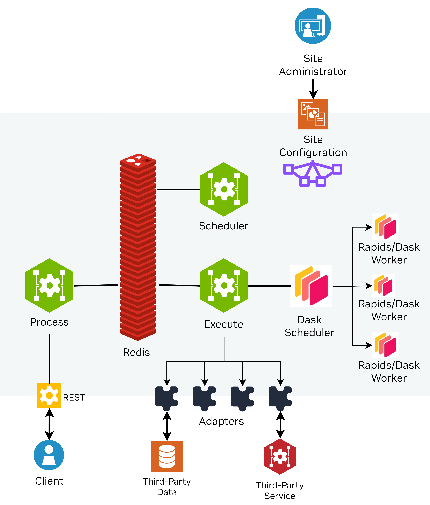

# Earth-2 Weather Analytics Blueprint - DFM

The Earth-2 Weather Analytics Omniverse blueprint uses Data Federation Mesh or DFM for reference implementation for processing, scheduling and executing the pipelines that create the data that is used by the kit application for the visualization.

## Data Federation Mesh

*Data Federation Mesh* (*DFM*) is a distributed and
programmable framework for managing and orchestrating various microservices as illustrated by the Earth-2 blueprint.

It provides an additional layer of distributed control, helping you to execute
programmable pipelines in the cloud.
As glue code, DFM generally does not perform any “heavy lifting,” such as computations
or data movement.
Instead, it focuses on integrating individual components, ensuring they work together
seamlessly, and introducing dynamic behavior into the system.

DFM addresses the following points:

- Clients send programmable pipelines, expressed as graphs represented in JSON, to the
    DFM. The DFM platform functions as a distributed virtual machine that executes
    client requests.
    Unlike traditional virtual machines, such as Java’s, the DFM is a virtual machine
    composed of distributed cloud services operating on top of heavy-duty external
    services.
- DFM utilizes services (i.e., pods) that retain data as much as possible to perform
    multiple operations on the data whenever feasible.
    In the future, DFM will include optimizers to balance data movement and computation
    across distributed locations.
- Deploying a co-located set of DFM services creates a *Site*.
    The Site administrator has strict control over the resources provided and used by
    the Site.

### DFM Sites

The DFM codebase implements a set of services that are deployed together, generally
through a Helm chart.
These services interact with each other via a message broker (using *Redis*).
Such a collection of co-located intercommunicating DFM services is called a *Site*.

### Site Services

<div align="center">
<div align="center" style="max-width: 575px;">



</div>
</div>

A fully deployed DFM Site consists of the following services:

- **Execute**: The main service of the DFM that implements the majority of its
    functionality. The Execute service functions as a virtual machine that interprets
    and executes pipelines. It receives pipelines via a Redis instance and processes
    them by interacting with its configured external services through an *Adapter*
    plugin mechanism.
- **Process**: The entry point and frontend for clients.
    The Process service provides a RESTful API that clients can use to submit execution
    requests, perform discovery requests, and poll for results.
    When the service receives a pipeline, it first generates a request ID, which is
    returned to the client.
    The Process service then verifies and optimizes the request before enqueuing
    corresponding messages into Redis which will then be processed by the Execute
    service.
    Clients use the request ID to poll for responses produced by the site.
    Responses include either the results of submitted requests or status and error
    messages.
    Results are stored in a Redis queue at the client’s site under the request ID until
    the client retrieves them.
- **Scheduler**: A service that accepts executable pipelines from a Redis queue and
    schedules them for execution at a later time.
    Currently, the Scheduler only supports time-based delays but may eventually respond
    to events in future iterations.
    Adapters can use the Scheduler to re-queue parts of a pipeline for later execution -
    for example, when waiting for an external service to complete its task.
- **Redis**: Redis serves as both a database and a message broker between DFM services.
    Messages enter Redis through the Process service (due to client requests).
    The Execute service polls new messages from its respective message queue.

### Site Configuration

A Site’s deployment is managed by its administrator, who has full control over the
resources the Site utilizes.
There are three primary mechanisms for controlling a Site’s functionality:

1. **Selecting DFM Services**:
    The administrator can determine which DFM services to deploy by modifying the Helm
    chart.
1. **Defining Execute Service Functionality**:
    The administrator can specify the interface and functionality provided by the local
    Execute service by editing the Site configuration YAML file.
1. **Configuring Secrets and Adapter Parameters**:
    The administrator can configure secrets (e.g., API keys, access tokens) and other
    "behind-the-scenes" parameters of the adapters to tailor the Site's behavior.

### Adapters

Adapters are plugin-like components that extend the functionality of the Execute
service.

#### The Client's View

The Site provides its functionality to a client via `FunctionCalls`.
A `FunctionCall` is a JSON schema used to request a documented piece of functionality.
If the client is written in Python, the JSON schema is exposed as Pydantic models.
Similar to function calls in a local programming language, DFM `FunctionCalls` can be
nested, allowing the results of one call to be passed as input to another.

For example, consider a `FunctionCall` in a pipeline, such as `LoadEra5ModelData` in
the following code snippet:

```python
weather_data = dfm.api.data_loader.LoadEra5ModelData(
    provider='some_provider',
    ...
)
tex = dfm.api.xarray.ConvertToUint8(
    data=weather_data,
    ...
)
...
```

This defines an abstract interface for the underlying functionality.
It is equivalent to defining a virtual function in a `.h` header file in C++.
The function’s signature is specified without including its implementation.
All DFM function calls are located in the `dfm.api` package.

A pipeline similar to the one above is sent to a Site for execution (e.g., let's use
`my_site` as site name in this example).
Each `FunctionCall` requires the specification of a `provider`.
If no provider is specified, the default provider is set to `dfm`.
A helpful mental model here is Object-Oriented Programming (OOP): the above call to
`LoadEra5ModelData()` can be thought of as `my_site.some_provider.LoadEra5ModelData(...)`.
The actual implementation invoked by this abstract function call is defined within
`some_provider` and depends on its specific implementation.

Note:
Just as in OOP, there can only be a single function with the same name and signature
within a given provider object (DFM does not support overloading).
Therefore, when a Site needs to provide functions with the same interface/API but
variations in functionality (e.g., multiple versions of `LoadModelData(...)`, each
accessing different backends or utilizing different protocols), the DFM solution
-- similar to OOP -- is to use multiple providers.
For example: `LoadModelData(provider='s3_buckets', ...)` and
`LoadModelData(provider='postgres_db', ...)`.
These can be interpreted as `my_site.s3_buckets.LoadModelData(...)` and `my_site.postgres_db.LoadModelData(...)`.

## Data Federation Mesh for Earth-2
The blueprint has xxx

#### Developing a custom adapter
The current version of the blueprint provides a couple of templates xxxx (links to the source code) to enable a developer to create a custom adapter. You will need the following to start:
* xxx
* xxx
Here are the steps to follow:
* Get DFM running
* Use one of the existing templates to do xxx

<!-- Footer Navigation -->
---
<div align="center">

| Previous | Next |
|:---------:|:-----:|
| [Omniverse App](./04_omniverse_app.md) | [Sequence Diagram](./06_sequence.md) |

</div>
