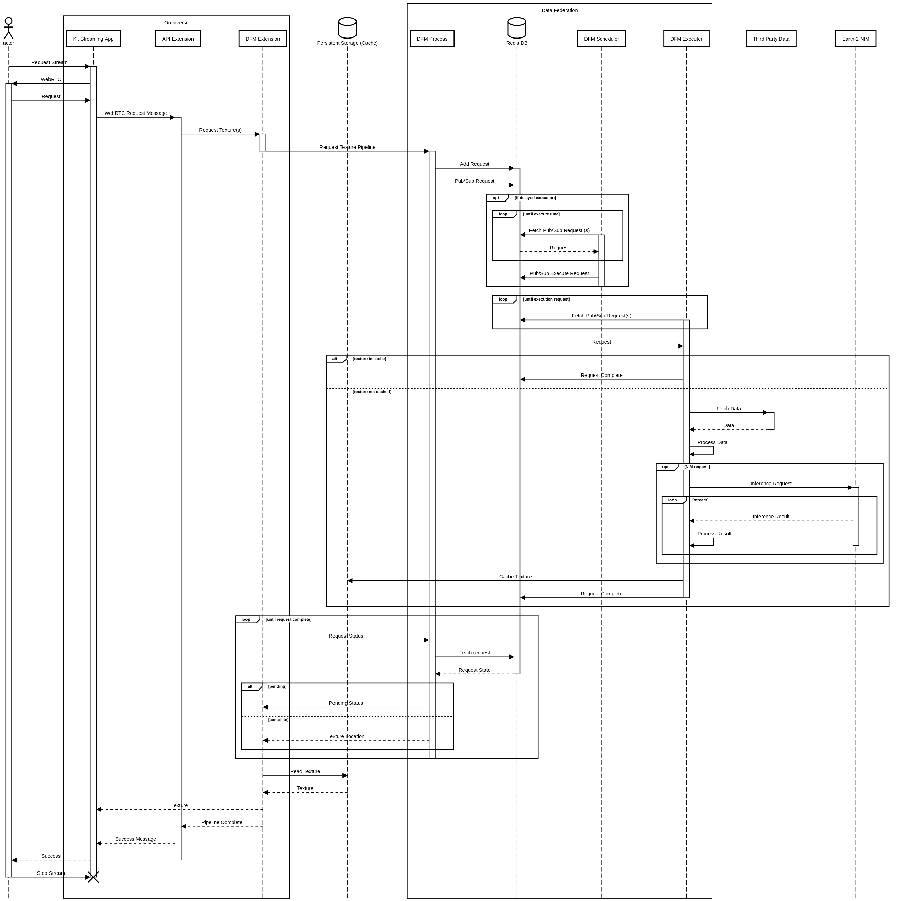

# Earth-2 Weather Analytics Blueprint - Sequence Diagram

The following sequence diagram shows the streaming workflow of the Earth-2 Weather
Analytics Blueprint for a FourCastNet NIM inference request as a reference.

<!-- Footer Navigation -->
---

| Previous | Next |
|:---------:|:-----:|
| [Data Federation Mesh](./05_data_federation_mesh.md) | [Troubleshooting](./07_troubleshooting.md) |

